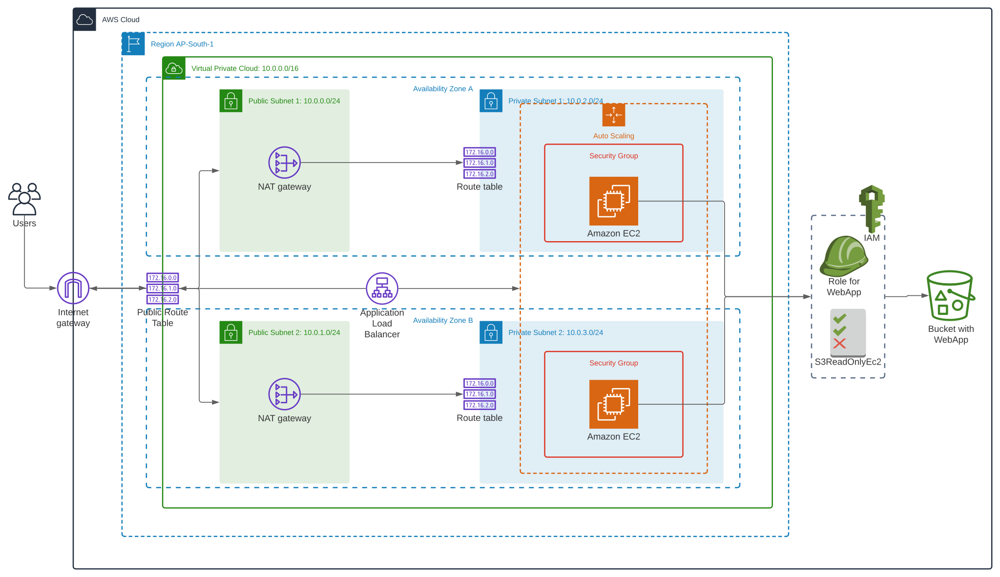

# High Availibility WebApp Using Cloudformation

> In this Project, I have deployed a High Availability WebApp using CloudFormation
> This script automatically deploys the whole infrastructure for the WebApp from Scratch
> Networking Components are the first to get deployed following Auto Scaling Group(Servers), IAM Security Roles and Load Balancer

## To deploy this Just run:
'''sh
> ./create.sh my-webapp my_infra.yaml my_prams.json
'''